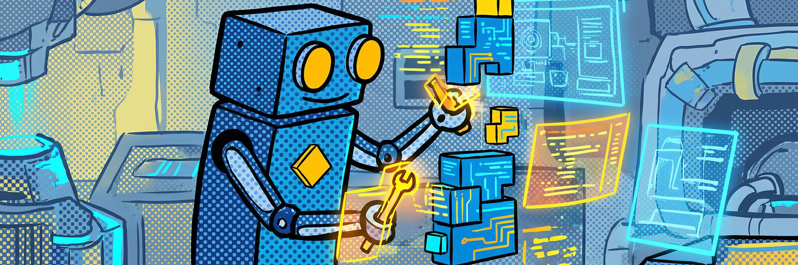

<p align="center">
  
</p>

# Sepp’s Workshop for VS Code

<p>
  
  
</p>

One dark colour theme for VS Code (Visual Studio Code), built on sepp.med Darkblue with Sunset yellow as the accent. The editor sits on a deepened Darkblue, framed by Darkblue itself. There are no variants and no settings to wrestle with: this is the one theme.

The colours come from the [Sepp’s Workshop design system](https://github.com/sepps-workshop/sepps-workshop-design-system), whose build refuses to ship a text colour that fails WCAG AA on its surface. The tests in this repository check the combinations the theme adds on top: code on diff, merge and selection backgrounds, and text on selected rows.

<p align="center">
  
</p>

## Install

The theme is not on the VS Code Marketplace yet. Until it is, build the extension yourself. You need Node.js 20 or later.

```bash
git clone https://github.com/sepps-workshop/sepps-workshop-vs-code.git
cd sepps-workshop-vs-code
npm install
npm run package
code --install-extension sepps-workshop-theme-0.1.0.vsix
```

Then pick **Sepp’s Workshop** from `Preferences: Color Theme` (`Ctrl+K Ctrl+T`, or `Cmd+K Cmd+T` on macOS).

## Recommended font

Themes cannot ship fonts. The design system recommends [JetBrains Mono](https://www.jetbrains.com/lp/mono/) for the editor, and [JetBrainsMono Nerd Font](https://www.nerdfonts.com/font-downloads) for the integrated terminal if your prompt shows icons.

```jsonc
"editor.fontFamily": "\"JetBrains Mono\", \"Cascadia Code\", Consolas, monospace",
"terminal.integrated.fontFamily": "\"JetBrainsMono Nerd Font\", \"JetBrains Mono\", monospace"
```

## How it is built

The theme file is generated. Colours, contrast ratios and the map from syntax role to colour all come from the design system. This repository only decides which token feeds which VS Code setting. It contains no colour value of its own, and a test fails if one appears.

A few things follow from the palette and are deliberate:

- Three hues carry the syntax (yellow, orange, cyan-blue), each at two lightness steps, with italics as a third axis. The brand has no more hues that stay apart on Darkblue.
- Selection and the current line darken the canvas. A lighter selection would cost contrast.
- Red and green are signals only: errors, additions, removals. Neither colours any syntax.
- The status bar stays neutral. The yellow strip along its top edge means a folder is open. While debugging, the bar turns red.

### Left at VS Code defaults

A setting the theme does not name keeps its VS Code default. These were left out on purpose, because the design system has no role for them:

- `editorOverviewRuler.findMatchForeground`, `.rangeHighlightForeground`, `.selectionHighlightForeground`, `.wordHighlightForeground`
- `tab.activeBorder`, `menu.selectionBorder`, `menubar.selectionBorder`
- `editorUnnecessaryCode.opacity`
- `charts.purple` (the brand has no purple)
- `statusBarItem.prominentHoverBackground`

## Contributing

```bash
npm install
npm run build   # regenerates themes/ and icon.png from @sepps-workshop/design-system
npm test
```

To preview locally, press `F5` in VS Code. That opens an Extension Development Host, where you can pick the theme.

If a colour looks wrong, or two things are hard to tell apart, the cause is almost always in the design system and not in this port. Please open the issue [there](https://github.com/sepps-workshop/sepps-workshop-design-system/issues). A mapping mistake (the right colour on the wrong setting) belongs here.

## License

MIT. See [LICENSE](./LICENSE).

## Want to join Sepp’s Workshop?


sepp.med builds and tests software for places where a bug is more than an inconvenience: medical devices, cars, aircraft. We have been doing it since 1980, as a family-run company in the Nuremberg metropolitan region. If you would rather get the contrast ratio right than argue about it, you might like it here.

Browse the [open positions](https://www.seppmed.com/career/open-positions/), or send a [speculative application](https://www.seppmed.com/career/speculative-application/) if none of them fits yet. Be you – with us.
